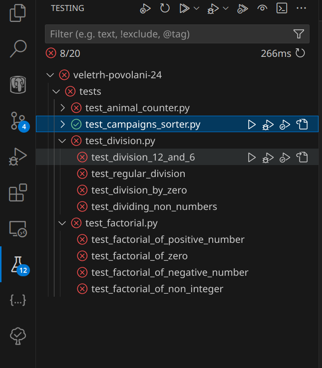

## Prerequisites

- [Python](https://www.python.org)
- [Pytest](https://docs.pytest.org/en/latest/)
- [VsCode](https://code.visualstudio.com)
- [Python Extension? (dont know if needed)](https://marketplace.visualstudio.com/items?itemName=ms-python.python)

## Folder Structure

Tests are located in `tests/` folder. :D

Empty functions, which are used by default in tests, are located in `functions/` folder.

Finished functions are in `finished_functions/` folder.

To use already finished functions, simply change the imports in the `test/test_*.py` files from `functions.*` to `finished_functions.*`.

_There is also one real-life example of a finished function in `finished_functions/campaigns_sorter.py` with the `CampaignsSorter` class._

## Usage

To run tests

1. You can use CLI:

```bash
pytest .
```

2. Or you can use VSCode testing extension:


